# Mountains Generation

The mountains are generated using L-system method created in 2005 by Daniel Ashlock.

**To run the project, do the following:**

1. Go to the file _args.py_ which contains user input.
    - `start_height = 20` - the start level for tile generation; it doesn't affect the visualization though.

    - `size` - size of one tile; must be a degree of 2

    - `mountain_type` - type of one mountain to generate; possible types are: `TileType.CALM`, `TileType.HILL`, `TileType.STEEP`.

    - `mountain_comb` - an two-dimensional array containing a combination of mountain tile types to construct. When constructed, all the tiles are connected.

2. In the terminal, run:

```bash
pip install requirements.txt
python main.py
```

3. The script will ask what would you like to generate - a mountain or a forest of mountains. If you choose the first option, then the algorithm will generate whatever is `mountain_type` set to. If you choose the second option, then the algorithm will generate a set of mountains as specified in `mountain_comb`.


## The results

### "Calm" type
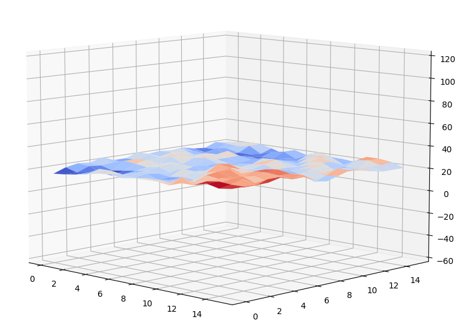

### "Hill" type
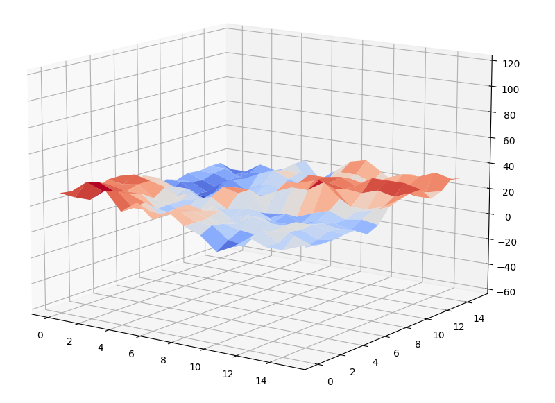

### "Steep" type
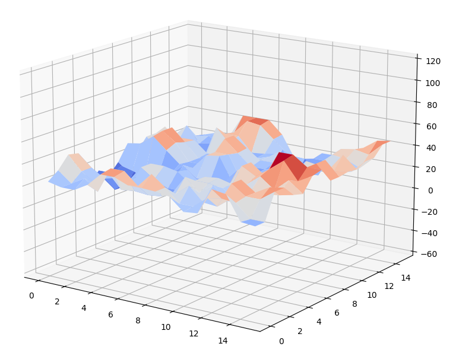

### Combinations of types
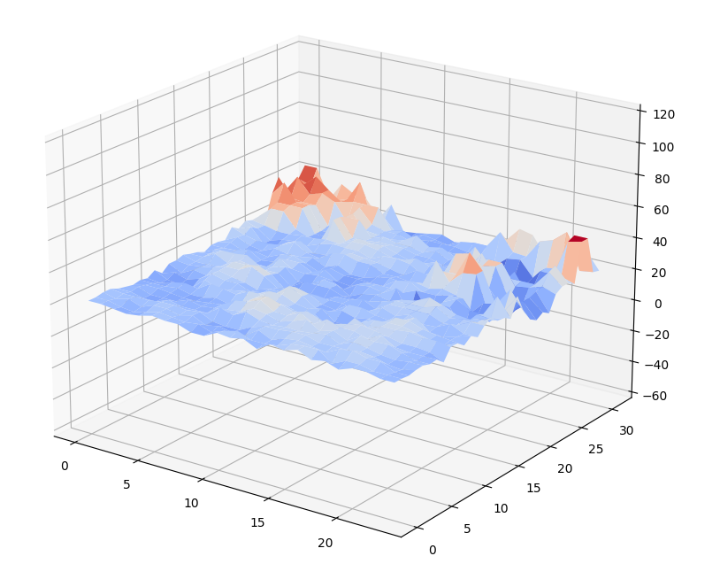
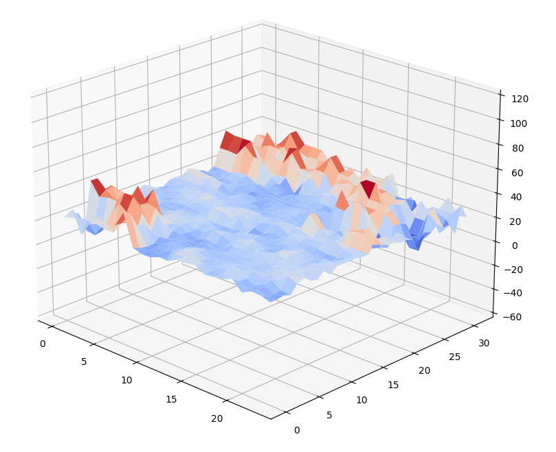
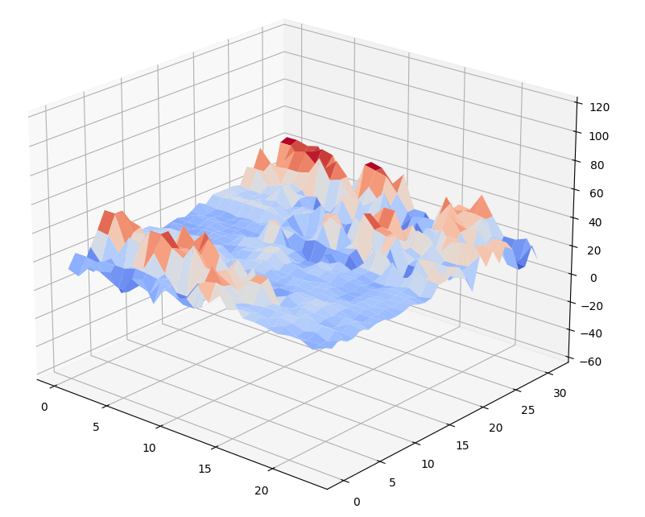

### Timing

| map size and tile size | generation time, s | generation + visualization time, s | the result                                                   |
| ---------------------- | --------------- | ------------------------------- | ------------------------------------------------------------ |
| 1x1 x 8x8              | 0.00892         | 0.01078                         | 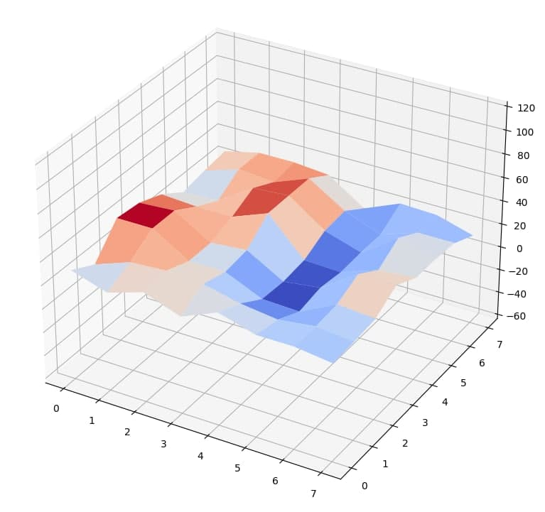 |
| 1x1 x 16x16            | 0.11135         | 0.11398                         | 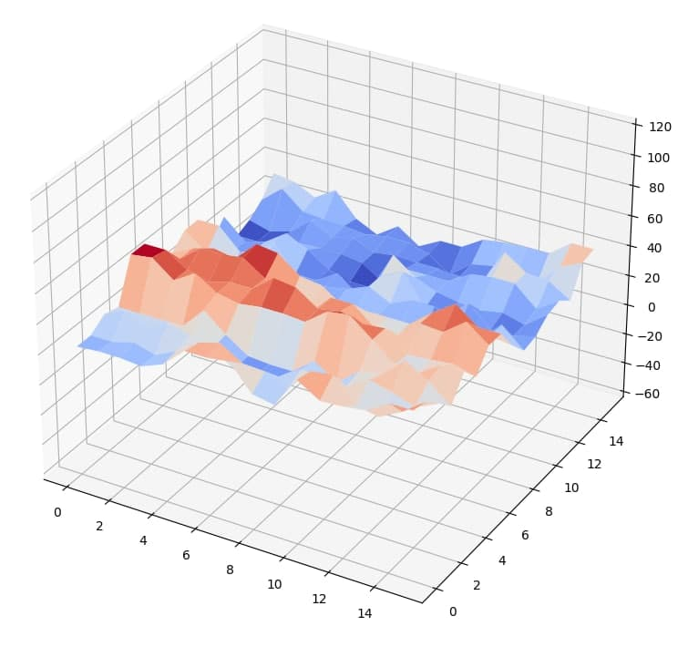 |
| 1x1 x 32x32            | 1.84991         | 1.85417                         | 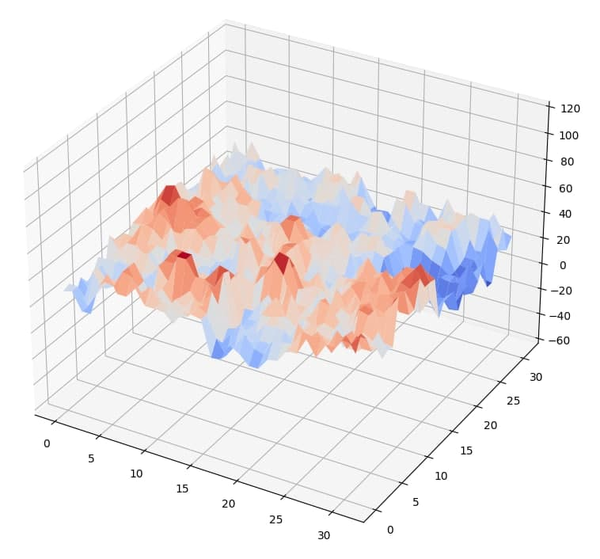 |
| 4x4 x 8x8              | 0.09771         | 0.10152                         | 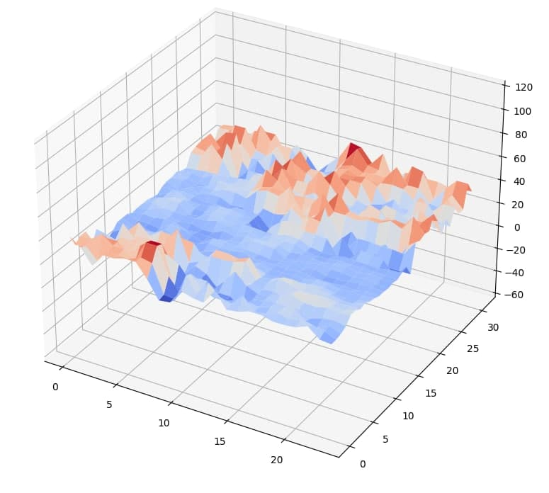 |
| 4x4 x 16x16            | 1.30003         | 1.34257                         | 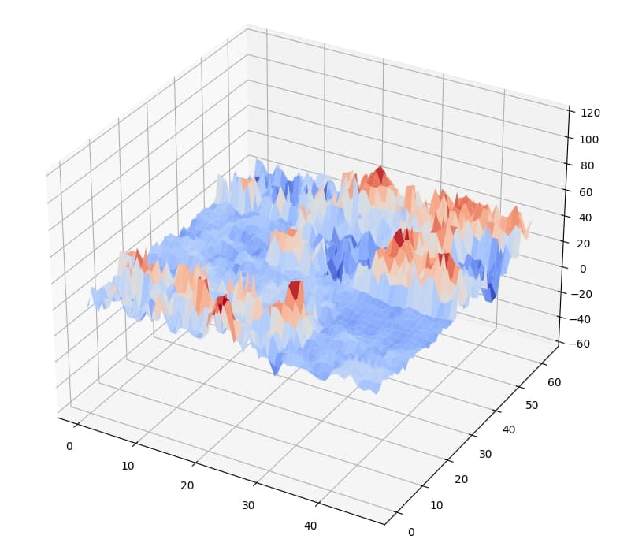 |
| 7x7 x 8x8              | 0.39618         | 0.42008                         | 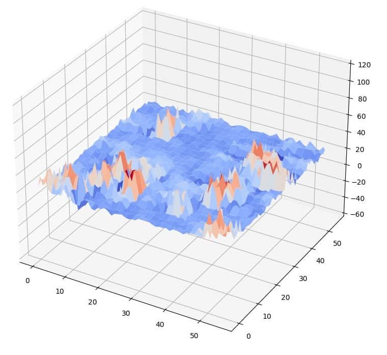 |
| 7x7 x 16x16            | 5.30813         | 5.33290                         | 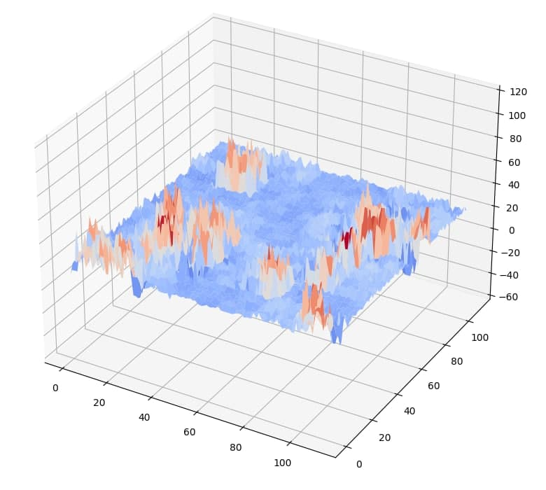 |
